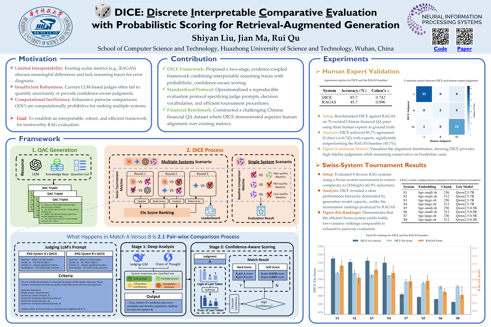

# DICE



<!--  -->

Code for evaluating RAG systems with interpretable reasoning and probabilistic scoring.

This repository implements **DICE** (Discrete Interpretable Comparative Evaluation), a framework introduced in [ResponsibleFM @ NeurIPS 2025](https://openreview.net/forum?id=RNz4AfOfh3) for responsible, explainable, and confidence-aware RAG evaluation.

## Features

- Evidence-coupled reasoning for transparent decision-making
- Probabilistic {A, B, Tie} scoring for confidence-aware judgments
- Efficient large-scale evaluation with Swiss-system tournament
- Reproducible benchmarks for multi-system comparisons

## Installation

1. Clone the repository:
   ```bash
   git clone https://github.com/shiyan-liu/DICE.git
   cd DICE
   ```
2. Install dependencies:
   ```bash
   pip install -r requirements.txt
   ```

## Usage

### 1. Prepare Your Data

To evaluate your own RAG systems, save your generation results in JSON files with the prefix `qacg_` (e.g., `qacg_system_a.json`).

Required JSON format for each system:

```json
[
  {
    "question": "What is the capital of France?",
    "rag_answer": "The capital is Paris.",
    "context": ["Paris is the capital and most populous city of France."],
    "groundtruth": "Paris"
  },
  ...
]
```

Place these files in a directory (e.g., `my_systems/`).

### 2. Run Evaluation

#### Scenario A: Compare Multiple Systems (Tournament)

If you have 4 or more systems to compare, use the tournament mode. This runs a Swiss-system tournament to efficiently rank your systems.

```bash
python src/scripts/run_dice.py --scenario tournament --input_dir my_systems/
```

#### Scenario B: Evaluate a Single System (Baseline Comparison)

If you have a single system (or fewer than 4) and want to evaluate its absolute quality, compare it against built-in baselines (Good, Medium, Bad).

```bash
python src/scripts/run_dice.py --scenario baseline --target_file my_systems/qacg_my_system.json --target_system MySystemName
```

#### Scenario C: Compare All Pairs (Round Robin)

For a comprehensive comparison of all systems against each other (N*N), use the allpairs mode. Note that this requires more API calls.

```bash
python src/scripts/run_dice.py --scenario allpairs --input_dir my_systems/
```

### 3. Generate Synthetic Data (Optional)

If you don't have RAG outputs yet, you can generate benchmark data using our provided knowledge base in `dataset/`.

```bash
python src/scripts/generate_data.py --num_questions 20 --output_dir my_systems
```

### 4. Run RAGAS Evaluation (Optional)

To run standard RAGAS metrics alongside DICE:

```bash
python src/scripts/run_ragas.py --input_dir my_systems/ --output_dir ragas_results
```

## Reference

If you use DICE in your work, please cite:

```bibtex
@inproceedings{liu2025dice,
  title={DICE: Discrete Interpretable Comparison Evaluation with Probabilistic Scoring for Retrieval-Augmented Generation},
  author={Liu, Shiyan and Ma, Jian},
  booktitle={Socially Responsible and Trustworthy Foundation Models at NeurIPS 2025}
}
```
